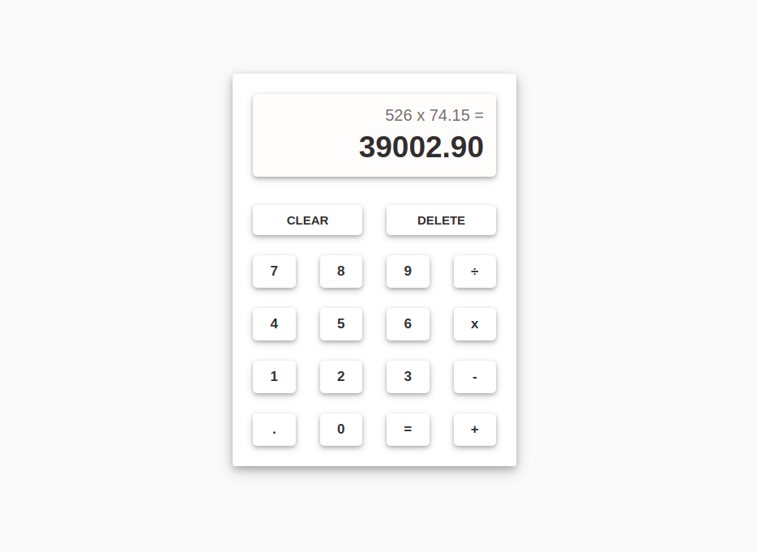

# Calculator



This application implements a basic calculator for arithmetic operations and it is the submission for [The Odin Project: Calculator](https://www.theodinproject.com/lessons/foundations-calculator). The key features are:

- Perform Basic Arithmetic Operations
- Keyboard Support
- Cross-Platform Compatibility


## Live Demo

[Calculator](https://jesusgraterol.github.io/calculator-top/)


## Getting Started

### Requirements

- GIT

### Installation

1) Clone the repository
```bash
git clone git@github.com:jesusgraterol/calculator-top.git
```


## Usage

Open the `index.html` file with your favorite browser.


## Build Process

N/A


## Deployment

Deploys to **Github Pages** automatically when commits are pushed into the `main` branch.


## Built With

- HTML5
- CSS3
- JavaScript


## Running the Tests

```bash
# Unit Tests
N/A

# Integration Tests
N/A

# E2E Tests
N/A
```


## @TODO

N/A


## License

[MIT](https://choosealicense.com/licenses/mit/)


## Acknowledgments

N/A